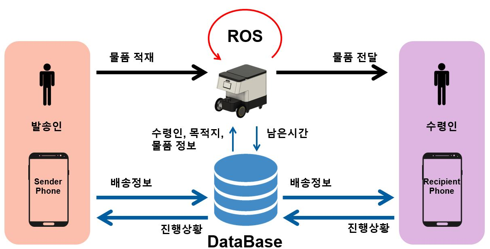
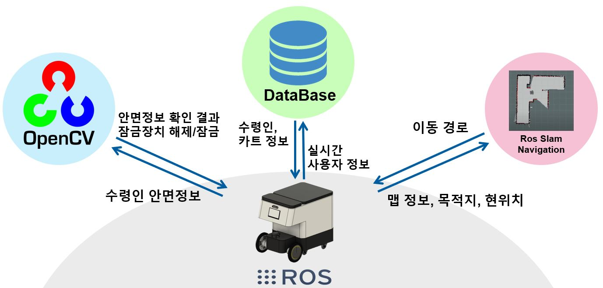
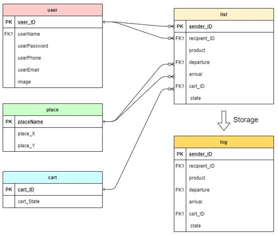
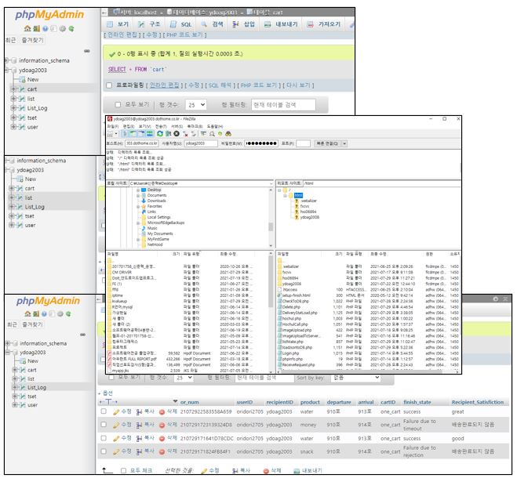
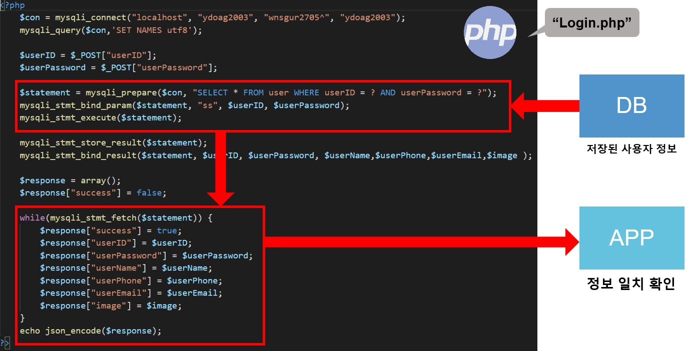
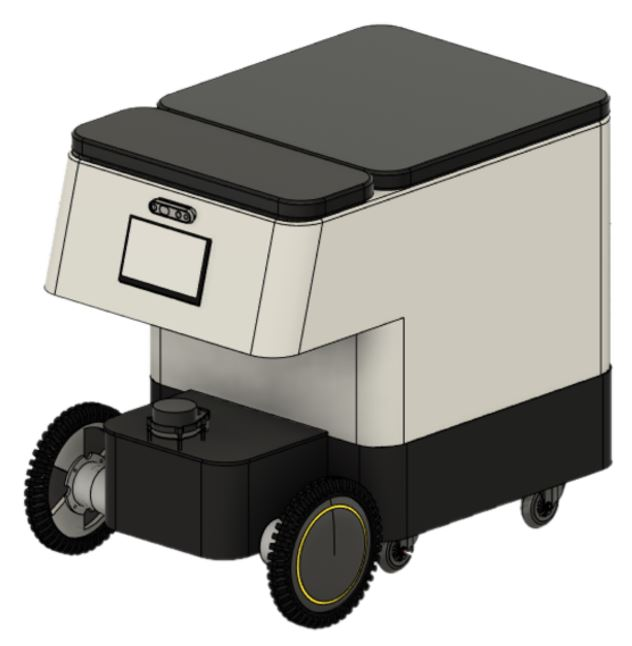
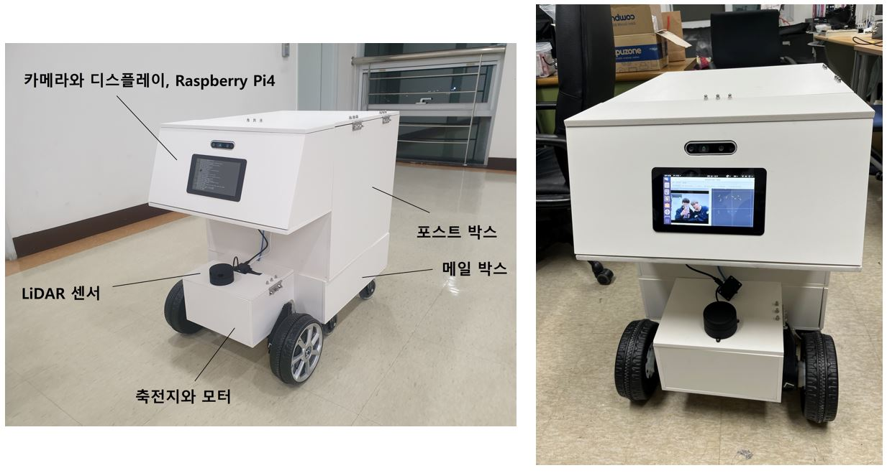
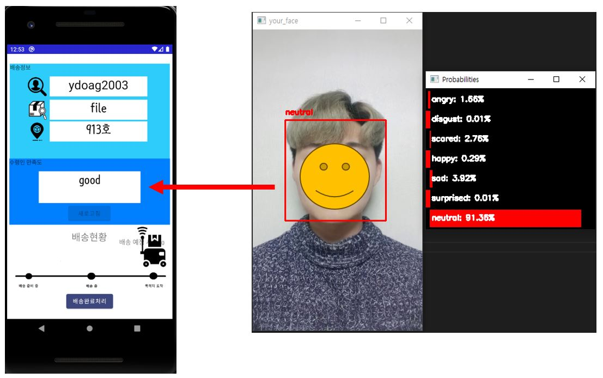

#  INDIGO 🛵📦      자율주행을 활용한 실내 스마트 카트 시스템
논문 링크 : https://www.dbpia.co.kr/journal/articleDetail?nodeId=NODE10664647
    

## 🏆 교외 및 교내 수상

> ### 2021년 한국정보기술학회 우수논문상 동상

> ### 2021년 학부융합 프로그램 동상

수상 내역 보기

      

## ⚙ INDIGO 구성도

         

## 🤖 ROS 구성도

         

## 📱 UI 화면

         

## 👨‍💻 DB 설계

         

## 💻 phpMyAdmin 화면

         

## 👨‍🏫 코드 설명

         

## 📜 설계도 

         

## 🚚 완성품

         

## 🤔😄 얼굴인식 및 감정인식

         
